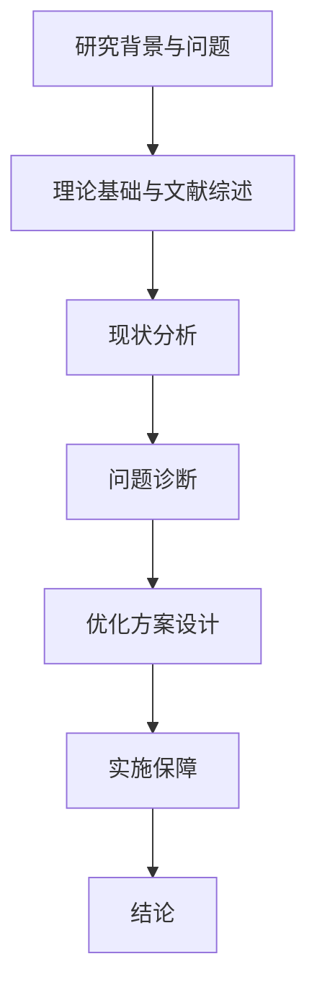

# MBA 学位论文模板（7 章结构）

## 封面

> 论文题目：基于 [理论] 的 [企业] [问题] 优化策略研究
> 学校：[目标院校]
> 专业：工商管理硕士（MBA）
> 学生姓名：[姓名]
> 指导老师：[导师姓名]

---

## 第 1 章 绪论

### 1.1 研究背景

【行业背景 + 企业痛点 + 现实问题的紧迫性】

### 1.2 研究问题

【核心研究问题 + 子问题分解】

### 1.3 研究意义

- **理论意义**：【延伸/验证了 XX 理论在 XX 情境的适用性】
- **实践意义**：【为 XX 行业/企业提供可操作的管理建议】

### 1.4 研究方法

【案例研究法 / 问卷调查 / 深度访谈 / 数据分析 等】

### 1.5 技术路线

---

## 第 2 章 理论基础与文献综述

### 2.1 [理论 1]

**定义：** 【理论的核心定义】
**核心观点：** 【理论的主要观点】
**分析框架：** 【可操作的分析维度】
**适用边界：** 【该理论适用的情境和限制】

### 2.2 [理论 2]

**定义：** 【同上】
**核心观点：** 【同上】
**分析框架：** 【同上】
**适用边界：** 【同上】

### 2.3 文献综述

- **国外研究现状：**【按时间脉络或主题归纳】
- **国内研究现状：**【按时间脉络或主题归纳】
- **研究缺口：**【现有研究不足之处，本研究要填补什么】

### 2.4 理论框架

【整合多个理论的分析框架图。说明各理论之间的关系，以及如何用于本研究的分析】

---

## 第 3 章 [企业] 现状分析

### 3.1 行业背景

【行业规模、增长趋势、竞争格局、政策环境】

### 3.2 企业概况

【企业简介、组织架构、主营业务、经营状况】

### 3.3 现状描述

【当前的做法、核心运营数据、关键指标表现、与行业标杆对比】

### 3.4 问题识别

【基于数据的初步问题定位】

---

## 第 4 章 问题诊断与成因分析

### 4.1 [维度 1] 分析

【使用理论工具 → 对企业数据进行分析 → 发现具体问题】

### 4.2 [维度 2] 分析

【同上】

### 4.3 根因诊断

【综合多个维度分析结果，判断问题的根本原因】

---

## 第 5 章 优化方案设计

### 5.1 方案设计原则

【理论指导 + 企业实际约束 + 行业最佳实践】

### 5.2 [方案 1]

【具体措施、实施步骤、预期效果、优缺点分析】

### 5.3 [方案 2]

【同上】

### 5.4 方案选择

| 评价维度 | 权重 | 方案1 | 方案2 |
|---------|------|-------|-------|
| 实施成本 | 20% | ★★★ | ★★ |
| 预期效果 | 30% | ★★★ | ★★★★★ |
| 实施难度 | 20% | ★★★★ | ★★ |
| 风险水平 | 15% | ★★★★ | ★★★ |
| 可持续性 | 15% | ★★★ | ★★★★ |
| **加权总分** | 100% | **X** | **Y** |

**推荐方案：**【方案名称】
**推荐理由：**【基于评分结果和定性分析说明】

---

## 第 6 章 实施保障与预期效果

### 6.1 实施路径

【分阶段实施，明确各阶段目标和关键里程碑】

| 阶段 | 时间 | 主要任务 | 交付物 |
|------|------|---------|--------|
| 第一阶段 | 第1-3月 | ... | ... |
| 第二阶段 | 第4-6月 | ... | ... |
| 第三阶段 | 第7-9月 | ... | ... |

### 6.2 组织保障

【组织架构调整、职责分工、跨部门协作机制】

### 6.3 人才保障

【培训计划、关键人才引进、激励机制】

### 6.4 资金保障

【预算分配方案、投入产出测算】

### 6.5 制度保障

【考核制度、激励制度、流程规范】

### 6.6 预期效果

【定性效果 + 定量效果预测（KPI改善幅度）】

---

## 第 7 章 结论与展望

### 7.1 研究结论

【3-5 条核心发现】

### 7.2 理论贡献

【对理论的延伸、验证或补充】

### 7.3 实践启示

【对企业的管理建议】

### 7.4 研究局限

【样本局限、方法局限、时间局限、数据局限】

### 7.5 未来研究方向

---

## 参考文献

【APA 7 + GB/T 7714 格式】

## 致谢

## 附录
